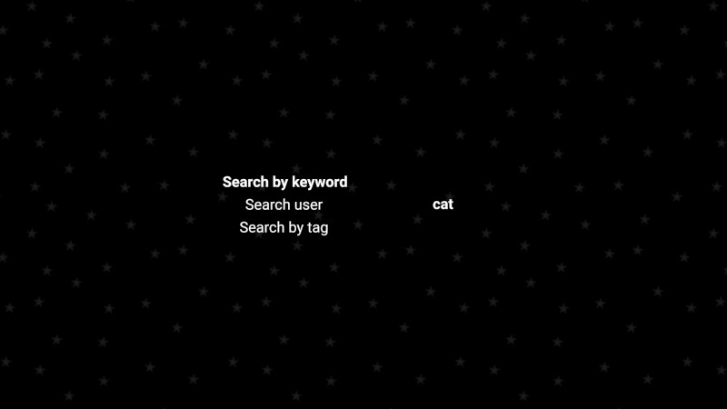
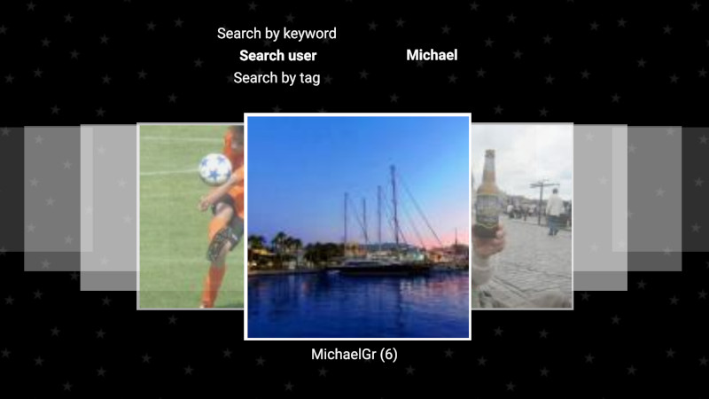

PhereoRoll3D
============

I was frustrated to not be able to use native autostereoscopic capabilities of my ELEPHONE P8 3D to watch stereophotographs of Phereo website ; so I made this app to display them nicely. Some other display modes were added afterwards.

The app is developped in c++ with Qt/QML and a tiny bit of Java. Although only tested on Android and Linux, it is supposed to work on many platforms if compiled for them. Only Android prebuilds are provided.

**Status: Working**

This software is created on my spare time for my own usage, but I share it as a free software (MIT licence, see afterwards). If you really want to thank me for this sharing, you can find my email in my phereo profile.

Source code is available, so if it lacks something for you, feel free to contribute yourself and share your changes back. Patches are welcome. I do not accept to be paid to add a feature, but some freelancers might do.

* [Compatibility](#compatibility)
* [Usage](#usage)
* [Stereo screenshots](#stereo-screenshots)
* [Download or build](#download-or-build)
* [Licence](#licence)

Compatibility
-------------

Precompiled APK are compatible down to Android API 16 which is 4.1/Jelly Bean. Motivated users with older Android version can try to compile with an older version of the framework, say Qt5.6, which should theorically work although untested.

Most 3D tablet and phones use either vertical parallax barrier or lenticular film. The app should work with all of them (provided that Android version is not too old).

Devices that use software-activated barrier are likely to not work, except if you can activate the barrier outside of the app. Experimental activation is present since v0.6 for somes models, but no feedback has been given at the time of writing.

**Known be compatible:**\
Elephone P8 3D\
PPTV King 7S 3D\
Doogee Y6 Max 3D\
ZTE Axon 7 Max 

**Known to not be compatible:**\
Super D D1 (use LCD barrier)\
InFocus M550 (use LCD barrier)\
Evo 3D (old Android)\
HTC Thrill (old Android)\
Truly/Freevi tablet (old Android)

Usage
-----

The defaults parameters are set so that when the phone is in landscape orientation, the app displays itself in column-interleaved to be seen in 3D thanks to autostereoscopic display. You can use other type of 3D thanks to other display modes.

The app opens "Popular" list at startup.

### Keys

Volume Up/Down and Left/Right arrow keys: Previous/Next image

Back and Escape: Return to list view (or exit)

F and F11: Toggle fullscreen

### List view

This view lists all images of the currently selected category/user/album (only first items are loaded, but you can load more images).

(1)
Tabs to access Phereo's categories.
The current tab is underlined

(2)
Currently selected category/user/album

(3)
Current image number / Total images in the list.
A + sign is appended if there are more images in the list.
Clicking on the text loads next images.

(4)
List of images' thumbnails. Swipe to view all.

(5)
Current image thumbnail.
Click to view

(6)
Statistics of photos in categories.
It is limited to loaded images.

(7)
Informations about selected image (title, author, date, likes, views, comments).
Clicking on the author opens user photos, long press opens user infos.

(8)
The current display mode is shown.
Clicking on the about icon opens the about page.
Clicking on the magnifier icon opens the search page.
Clicking on the settings icon opens the settings page.

(+)
Top right click: Use alternative display 3D mode

### Photo view

This view shows the photograph and some of its metadata, including comments.

(1) Left edge

Click: Previous image in the current list

Slide up/down: Change zoom (when slide is started, you can go to the right of the screen to have finer control)

Two fingers: reset scale

(2) Rigt edge

Click: Next image in the current list

Slide up/down: Change divergence/z axis origin (when slide is started, you can go to the left of the screen to have finer control)

Two fingers: reset divergence

(3) Top edge

Click: Go to list

Slide or two fingers: Swap left/right

(4) Bottom edge

Click or slide: open infos

Two fingers: Reset image position

(5) Central zone

Use pinch to zoom/move image

(+)

Top right click: Use alternative display 3D mode

Right/Left swaps (not starting at one edge): Change picture

Up swipe: open infos/comments

Down swipe: close comments, info (and swap left/right chips if all is closed)

The information about image are

- Avatar of author (clicking on it opens user photos, long press opens user infos)
- Name of image
- Name of author (clicking on it opens user photos, long press opens user infos)
- Date of publication
- Number of likes, views, comments
- Optionally, categories of the photo (Popular, Featured, Staff)
- Description of image
- Currently selected category/user/album +  current image number / Total images in the list.
  A + sign is appended if there are more images in the list.
  Clicking on the text loads next images.
- Optionally, the list of tags
- Optionnally, the list of albums in which the image is (clicking on it opens the album)

A web icon is present on the right. When clicked, it opens the image URL on phereo website. On Android, if multiple apps can open the link, the system asks you to choose which one to use. As a consequence, it is a also a quick access to official phereo app (useful to quickly add a like on a picture). 

A download icon is present on the right. It is greyed when application has not the permissions to write, with a tick when the photo is already present, and normal when you can download. Clicking on it will download the stereophoto in side-by-side (parallel) format into [Pictures]/PhereoRoll3D/ folder, or open it if it is already there.

Clicking on the information zone opens comments if present.

Each comment has the avatar of its author, the date and the comment itself.

Clicking on the author name or avatar opens its gallery, long press opens user infos.

### Settings page

Select the orientation you want to show/change on the left list, and show/select associated 3D mode on the right list.

Click elsewhere to come back to list view.

### Search page

First select which type of search you want to do and type your keyword. When validated, the search starts.

To be able to display in 3D, the actual input is hidden and its content copied on the two views so that you can see the text. However, it is a quite rudimentary input. The selection is drawn with an underline.

User search displays its results in this page. Other searchs display the results in the list view.  

Stereo screenshots
------------------

Cross view

Parallel view

Download or build
-----------------

### Precompiled APK

APK is the format used by Android for applications package. This is the only binary version distributed. You can find them in the release page of github project.

The app is not available on Google's store, but you can install by opening the APK file in your phone/tablet. Actually, there are tons of resources that explain how to install an APK, so I will not detail here.

### Build for Linux/Windows/Mac/FreeBSD/EmbeddedLinux/QNX and so on

This is a simple Qt/QML project with no external dependancy. Just get Qt on your system, configure it if needed, and build either with qmake/make in command line or by opening the project in QtCreator. See documentation of this framework for more details.  

Licence
-------

MIT License

Copyright (c) 2018, 2019 JackDesBwa

Permission is hereby granted, free of charge, to any person obtaining a copy of this software and associated documentation files (the "Software"), to deal in the Software without restriction, including without limitation the rights to use, copy, modify, merge, publish, distribute, sublicense, and/or sell copies of the Software, and to permit persons to whom the Software is furnished to do so, subject to the following conditions:

The above copyright notice and this permission notice shall be included in all copies or substantial portions of the Software.

THE SOFTWARE IS PROVIDED "AS IS", WITHOUT WARRANTY OF ANY KIND, EXPRESS OR IMPLIED, INCLUDING BUT NOT LIMITED TO THE WARRANTIES OF MERCHANTABILITY, FITNESS FOR A PARTICULAR PURPOSE AND NONINFRINGEMENT. IN NO EVENT SHALL THE AUTHORS OR COPYRIGHT HOLDERS BE LIABLE FOR ANY CLAIM, DAMAGES OR OTHER LIABILITY, WHETHER IN AN ACTION OF CONTRACT, TORT OR OTHERWISE, ARISING FROM, OUT OF OR IN CONNECTION WITH THE SOFTWARE OR THE USE OR OTHER DEALINGS IN THE SOFTWARE.
