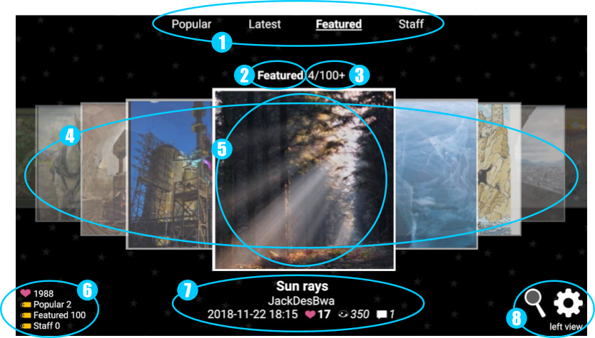
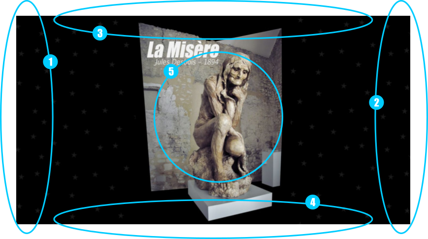
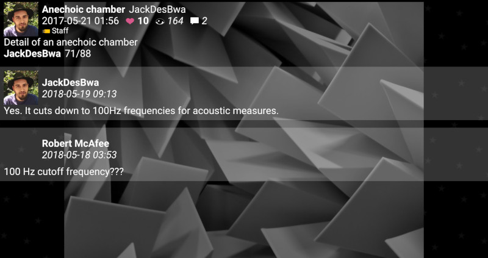
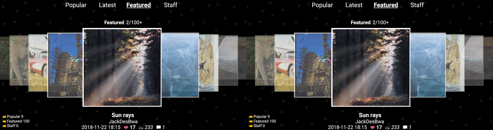
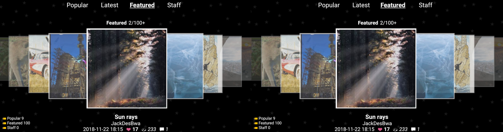

PhereoRoll3D
============

I was frustrated to not be able to use native autostereoscopic capabilities of my ELEPHONE P8 3D to watch stereophotographs of Phereo website ; so I made this app to display them nicely. Some other display modes were added afterwards.

Status: Proof of concept — It is working and I might improve depending of my needs (patches are welcome)

Usage
-----

The defaults parameters are set so that when the phone is in landscape orientation, the app displays itself in column-interleaved to be seen in 3D thanks to autostereoscopic display. You can use other type of 3D thanks to other display modes.

The app opens "Popular" list at startup.

### Keys

Volume Up/Down and Left/Right arrow keys: Previous/Next image

Back and Escape: Return to list view (or exit)

F and F11: Toggle fullscreen

### List view

This view lists all images of the currently selected category/user/album (only first items are loaded, but you can load more images).

(1)
Tabs to access Phereo's categories.
The current tab is underlined

(2)
Currently selected category/user/album

(3)
Current image number / Total images in the list.
A + sign is appended if there are more images in the list.
Clicking on the text loads next images.

(4)
List of images' thumbnails. Swipe to view all.

(5)
Current image thumbnail.
Click to view

(6)
Statistics of photos in categories.
It is limited to loaded images.

(7)
Informations about selected image (title, author, date, likes, views, comments).
Clicking on the author opens user photos, long press opens user infos.

(+)
Top right click: Use alternative display 3D mode

(+)
Bottom right: The current display mode is shown. Clicking on it opens the settongs page.

### Photo view

This view shows the photograph and some of its metadata, including comments.

(1) Left edge

Click: Previous image in the current list

Slide up/down: Change zoom (when slide is started, you can go to the right of the screen to have finer control)

Two fingers: reset scale

(2) Rigt edge

Click: Next image in the current list

Slide up/down: Change divergence/z axis origin (when slide is started, you can go to the left of the screen to have finer control)

Two fingers: reset divergence

(3) Top edge

Click: Go to list

Slide or two fingers: Swap left/right

(4) Bottom edge

Click or slide: open infos

Two fingers: Reset image position

(5) Central zone

Use pinch to zoom/move image

(+)
Top right click: Use alternative display 3D mode

The information about image are

- Avatar of author (clicking on it opens user photos, long press opens user infos)
- Name of image
- Name of author (clicking on it opens user photos, long press opens user infos)
- Date of publication
- Number of likes, views, comments
- Optionally, categories of the photo (Popular, Featured, Staff)
- Description of image
- Currently selected category/user/album +  current image number / Total images in the list.
  A + sign is appended if there are more images in the list.
  Clicking on the text loads next images.
- Optionally, the list of tags
- Optionnally, the list of albums in which the image is (clicking on it opens the album)

Clicking on the information zone opens comments if present.

Each comment has the avatar of its author, the date and the comment itself.

Clicking on the author name or avatar opens its gallery, long press opens user infos.

Select the orientation you want to show/change on the left list, and show/select associated 3D mode on the right list.

Click elsewhere to come back to list view.

Stereo screenshots
------------------

Cross view

Parallel view

Licence
-------

MIT License

Copyright (c) 2018 JackDesBwa

Permission is hereby granted, free of charge, to any person obtaining a copy of this software and associated documentation files (the "Software"), to deal in the Software without restriction, including without limitation the rights to use, copy, modify, merge, publish, distribute, sublicense, and/or sell copies of the Software, and to permit persons to whom the Software is furnished to do so, subject to the following conditions:

The above copyright notice and this permission notice shall be included in all copies or substantial portions of the Software.

THE SOFTWARE IS PROVIDED "AS IS", WITHOUT WARRANTY OF ANY KIND, EXPRESS OR IMPLIED, INCLUDING BUT NOT LIMITED TO THE WARRANTIES OF MERCHANTABILITY, FITNESS FOR A PARTICULAR PURPOSE AND NONINFRINGEMENT. IN NO EVENT SHALL THE AUTHORS OR COPYRIGHT HOLDERS BE LIABLE FOR ANY CLAIM, DAMAGES OR OTHER LIABILITY, WHETHER IN AN ACTION OF CONTRACT, TORT OR OTHERWISE, ARISING FROM, OUT OF OR IN CONNECTION WITH THE SOFTWARE OR THE USE OR OTHER DEALINGS IN THE SOFTWARE.
